# 公共课
---
# 找资料方式

- 公共课
  - 咸鱼、知乎、小红书、微博等等平台（白嫖/付费购买）
  
  - 在QQ群、微信群、微博群以物换物。（用这个老师换另一个老师的资料）
- 专业课
  - 找到对应学校，在咸鱼、知乎、小红书、微博等等平台，基本都有所谓的师兄师姐，给你卖资料。
  - 实在太冷门，那就只能看[中国大学MOOC（慕课）](https://www.icourse163.org)有很多免费公共课。
- 自行组团（最省钱）
  - 找个靠谱的人做团长，买几百块的付费课（前提是机构老师没发现）
  - 这种方式对于机构老师是不太尊重的，但对于学生来说，确实是最省钱的方法。。
  
--- 
## 政治
---
#### 齐老师（学习成本：地狱模式）（平台：微信公众号）（费用几百块）
> [!NOTE]
> 早年专插本政治名师，齐老师的模拟题和选择题过于抠字眼，真题没这么难，押题押了一本书，不适合速通选手，备考时间超6个月的同学，可以跟齐老师。

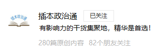

---
#### CB398（学习成本：速通模式）（平台：微信公众号）（费用几百块）
> [!NOTE]
> 早年专插本政治老牌机构，CB398的选择题和教材还不错。

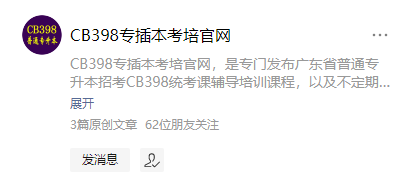

---
#### 华师科教（学习成本：速通模式）（平台：微信公众号）（费用几百块）
> [!NOTE]
> 早年专插本政治老牌机构，课程质量跟CB398差不多，勉强能看。 
> 唯一好处：这个机构有办法搞到专业课真题（可能有关系）

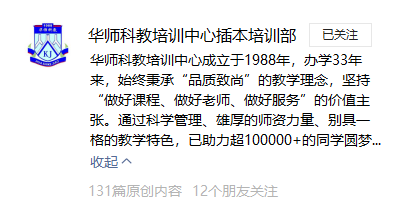

---
#### 奇迹老师（学习成本：速通模式）（平台：荔枝微课）（费用一千多块）
> [!NOTE]
> 奇迹老师直接整理各种表格、重点，直接背就好，奇迹老师并没有带读原文，学之前建议过一遍书本原文。

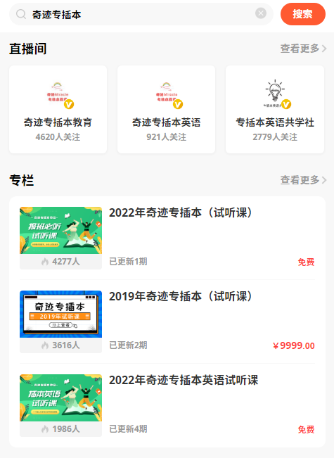

---
#### 嘉嘉老师（学习成本：稳扎稳打模式）（平台：千聊）（费用几十块）
> [!NOTE]
> 嘉嘉老师专门带读政治书本原文，教你画线画重点，坚持下来很容易记住。

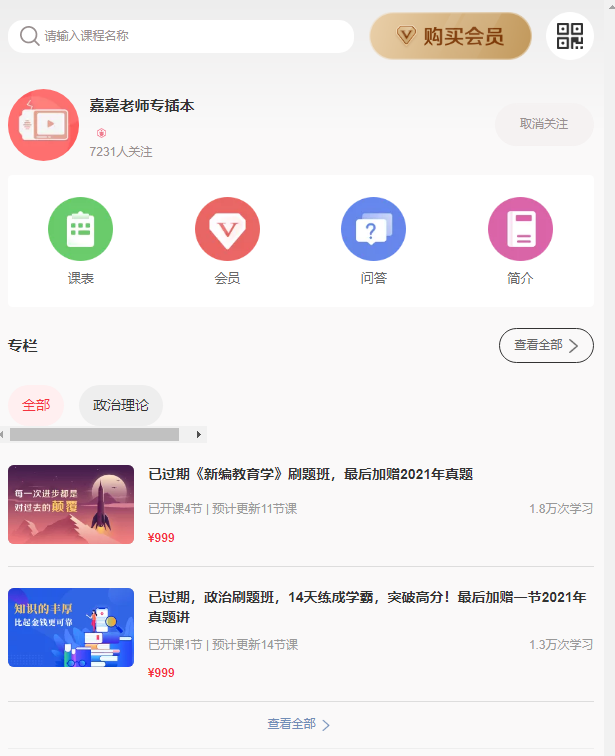

---
#### 黑马师兄（学习成本：地狱模式）（平台：微信公众号）（费用免费和收费）
> [!NOTE]
> 黑马师兄公众号有个打卡背诵，如果你能坚持下来，确实可以，毕竟押了整本书。

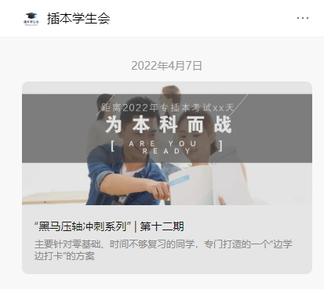

---
#### 其余老师（学习成本：褒贬不一）（平台：微信公众号）（费用收费）
> [!Danger]
> 千言万语，还不如一张图说明
图中的除了少烹饪（当时微博被网暴怀疑是作弊的同学），其余都是机构

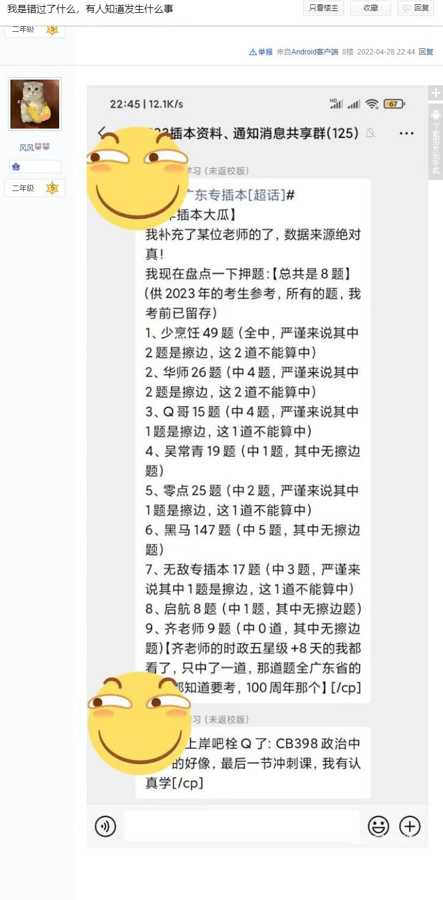

#### 个人建议政治路线
> [!NOTE]
> 嘉嘉老师 > 奇迹老师 > CB398 / 齐老师 > 华师科教 >其余新兴的机构 / 新兴老师

> [!TIP]
> 比如：什么白起、Q哥等等，最近几年来插本圈子的老师，均属于新兴老师。

#### 个人观点
> [!NOTE]
> 推荐嘉嘉老师的原因（价格比较实惠，顺便带读政治原文）  
> 政治学到后面，你会发现每个机构讲的都一样，最后一个月冲刺，都是看押题的，除非你是神仙（能记住整本书）  
> 政治押题通常押30题左右，整本书大概有160个大题。。

---

## 高数

#### 3Blue1Brown（学习成本：科普模式）（平台：哔哩哔哩）（免费）

> [!NOTE]
> 3Blue1Brown是B站数一数二的数学大佬，在国外YouTube上面也有许多数学博士留意.  
> 3Blue1Brown不是专门教《广东普通专升本》的，但他这个微积分系列，能帮助你快速理解微积分的奥秘，培养培养兴趣。

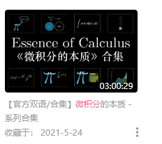
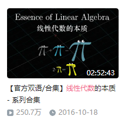
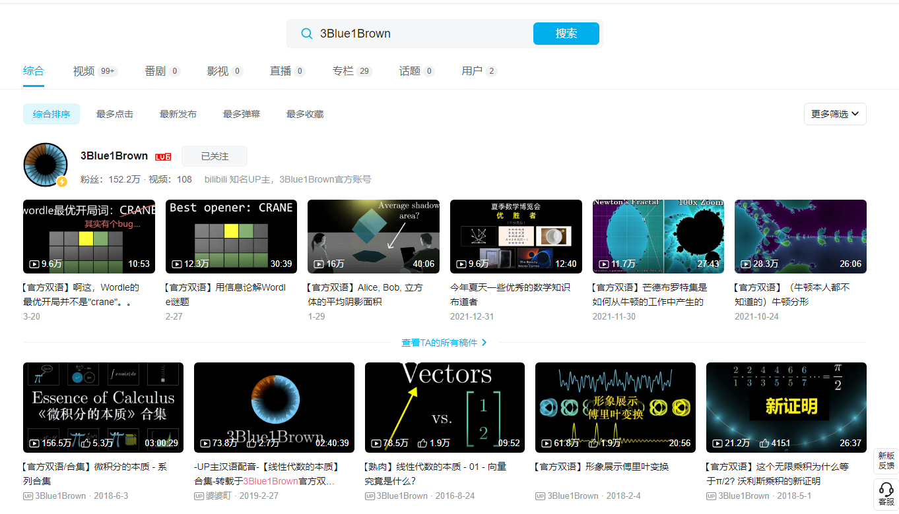

#### B站宋浩（学习成本：稳扎稳打模式）（平台：哔哩哔哩）（费用几百块 / 免费）
> [!NOTE]
> 宋浩老师不必多说，在考研圈子也是不错的选择，打基础用的。

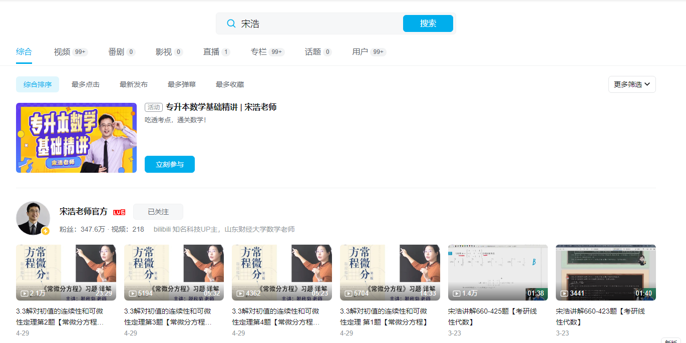

#### 石桥老师（学习成本：稳扎稳打模式）（平台：微信公众号）（费用几十-几百块 / 免费）
> [!NOTE]
> 石桥老师定期更新一些解题思路，是个专门负责专插本高数的老师，公众号非常多题目，平时多刷刷。

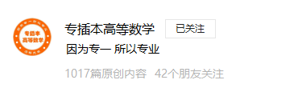

#### 个人建议高数路线
> [!TIP]
> 3Blue1Brown > 宋浩 > 石桥老师

#### 个人观点
> [!NOTE]
> 高数没啥好说的，学会基本微积分概念，就能开始题海战术，多点留意石桥老师公众号，有很多科普文

---

## 英语

#### 英语兔老师（学习成本：科普模式）（平台：哔哩哔哩）（费用几十-几百块）
> [!NOTE]
> 这个老师不是专门教《广东普通专升本》的，但系列视频做的还不错。

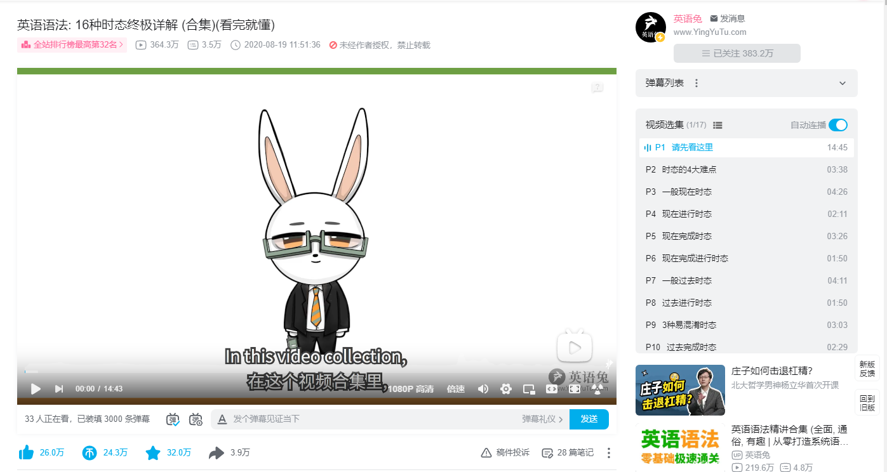

#### Isaac老师（学习成本：科普模式）（平台：微信公众号/哔哩哔哩）（费用几十-几百块）
> [!NOTE]
> 这个老师不是专门教《广东普通专升本》的，但微信公众号的科普文，还不错。

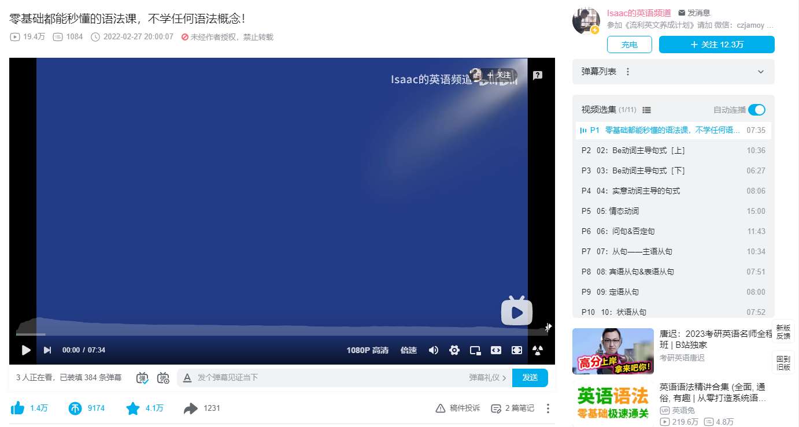

#### tim老师（学习成本：速通模式）（平台：微信公众号）（费用几百块）
> [!NOTE]
> tim老师的公众号，更新比较活跃，有猜题技巧和解题思路，但是也有不少广告，总体还不错。

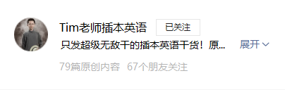

#### kimi老师（学习成本：地狱模式）（平台：微信公众号）（费用几百块）
> [!NOTE]
> kimi老师的课程布置作业比较多，全程跟下来，你会收获许多。

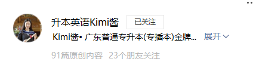

#### 个人建议英语路线
> [!TIP]
> 看点基本的语法 > kimi老师 > tim老师

#### 个人观点

> [!NOTE]
> - kimi老师 
> kimi老师是我见过的极致英语狂，课程每天都有作业。。 
>优点：跟着kimi老师，你真的坚持下来，还是挺不错的哈哈哈 
> 缺点：你报班不爱学英语，一样删你好友，当然也会随机删好友。。  
> - tim老师 
> tim老师讲课比较搞笑，还教你猜题技巧，拿60分没啥问题，想80分建议kimi老师。

